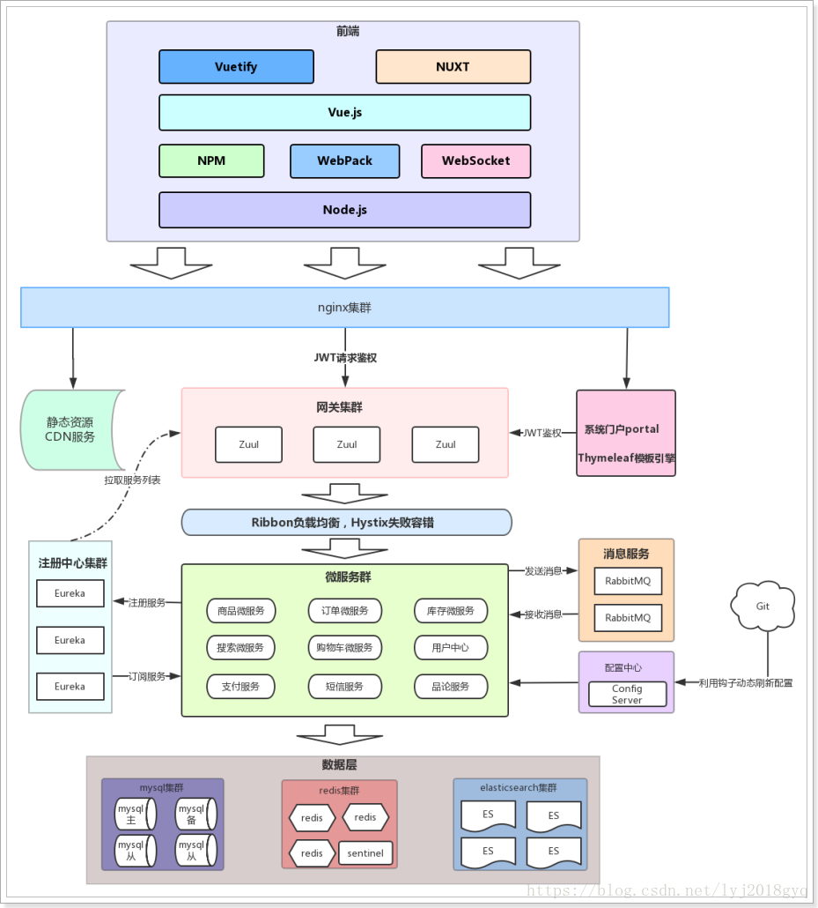

秒杀系统实现
==========

## 概述

### 限流

由于活动库存量一般都是很少，对应的只有少部分用户才能秒杀成功。所以我们需要限制大部分用户流量，只准少量用户流量进入后端服务器

### 削峰

秒杀开始的那一瞬间，会有大量用户冲击进来，所以在开始时候会有一个瞬间流量峰值。如何把瞬间的流量峰值变得更平缓，是能否成功设计好秒杀系统的关键因素。实现流量削峰填谷，一般的采用缓存和 MQ 中间件来解决

### 异步

秒杀其实可以当做高并发系统来处理，在这个时候，可以考虑从业务上做兼容，将同步的业务，设计成异步处理的任务，提高网站的整体可用性

### 缓存

秒杀系统的瓶颈主要体现在下订单、扣减库存流程中。在这些流程中主要用到 OLTP 的数据库，类似 MySQL、SQLServer、Oracle。由于数据库底层采用 B+ 树的储存结构，对应我们随机写入与读取的效率，相对较低。如果我们把部分业务逻辑迁移到内存的缓存或者 Redis 中，会极大的提高并发效率

## 系统架构

## 技术选型

[JWT]()
[Nginx]()  
[Redis]()  
[Kafka]()  
[AliSQL](https://github.com/alibaba/AliSQL?spm=a2c4e.10696291.0.0.34ba19a415ghm4)

## 相关文档

[淘宝双十一电商秒杀系统架构设计](https://www.jianshu.com/p/62cce4ba2b8a)  

[秒杀系统设计与实现](https://github.com/qiurunze123/miaosha)  

[参考博文](https://www.cnblogs.com/wuhen8866/p/11867674.html)  
[参考博文](https://zhuanlan.zhihu.com/p/93119691)  
[参考博文](https://www.zhihu.com/question/54895548)  
[参考博文](https://www.javazhiyin.com/46581.html)  
[参考博文](https://segmentfault.com/a/1190000020970562)  
[参考博文](https://juejin.im/post/5bb05d786fb9a05d1d2e1e68)  
[参考博文](https://www.ibm.com/developerworks/cn/web/wa-design-small-and-good-kill-system/index.html)  
